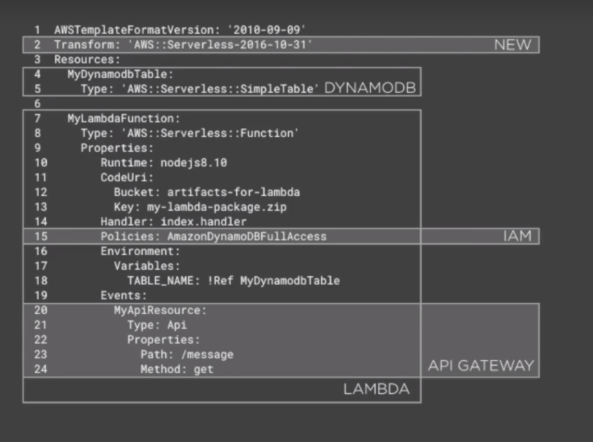
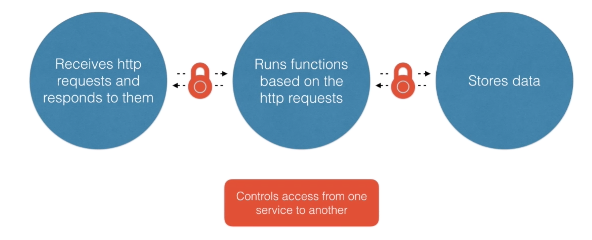
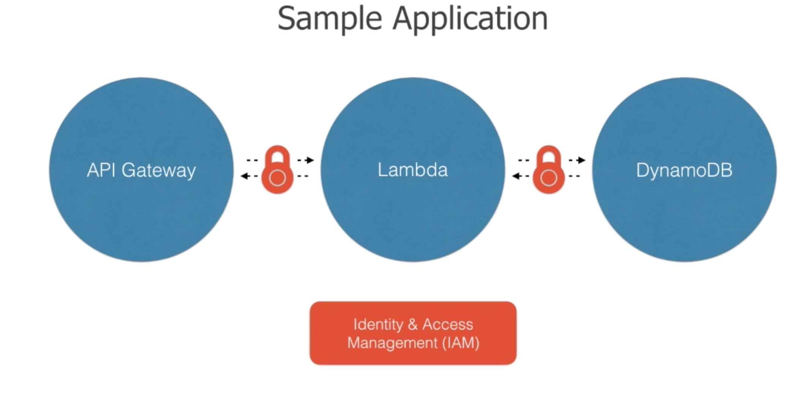

# Learning Serverless Application

## Table of Contents
<!-- START doctoc generated TOC please keep comment here to allow auto update -->
<!-- DON'T EDIT THIS SECTION, INSTEAD RE-RUN doctoc TO UPDATE -->

- [Getting to Know](#getting-to-know)
  - [AWS CloudFormation](#aws-cloudformation)
  - [Serverless Application Model (a.k.a. `SAM`)](#serverless-application-model-aka-sam)
    - [Serverless Resources](#serverless-resources)
    - [SAM Templates](#sam-templates)
    - [Serverless Deployments](#serverless-deployments)
- [Defining and Deploying a Basic Application](#defining-and-deploying-a-basic-application)
- [Defining and Deploying a Library Application](#defining-and-deploying-a-library-application)
- [Alternatives](#alternatives)
- [References](#references)

<!-- END doctoc generated TOC please keep comment here to allow auto update -->

## Getting to Know

### AWS CloudFormation

> Infrastructure as Code.

- Provide a common language for us to describe and provision all the infrastructure resources in our cloud environment.
- Allow us to use a simple text file to model and provision, in an automated and secure manner, all the resources needed for our applications across all regions and accounts. This file serves as the single source of truth for our cloud environment.

### Serverless Application Model (a.k.a. `SAM`)

#### Serverless Resources

| AWS Lambda Functions | Amazon API Gateway APIs | Amazon DynamoDB Tables |
| -------------------- | ----------------------- | ---------------------- |
| AWS::Serverless::Function | AWS::Serverless::Api | AWS::Serverless::SimpleTable |

#### SAM Templates

> Define and deploy SAM resources and non-SAM resources.

**`SAM Templates`** = **`CloudFormation Templates`** + **`SAM Resources`**

#### Serverless Deployments

 
<em>Before the Serverless Application Model</em>

 
 

 
<em>After the Serverless Application Model</em>

## Defining and Deploying a Basic Application

> Checkout [basic-app](basic-app) source.

## Defining and Deploying a Library Application

> Checkout [library-app](library-app) source.

## Alternatives

## References
- [Deploying Serverless Applications in AWS Using the Serverless Application Model](https://app.pluralsight.com/library/courses/aws-deploying-serverless-applications-application-model/table-of-contents)
