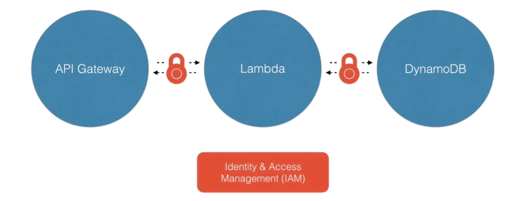

# Learning Serverless Application


## Table of Contents
<!-- START doctoc generated TOC please keep comment here to allow auto update -->
<!-- DON'T EDIT THIS SECTION, INSTEAD RE-RUN doctoc TO UPDATE -->


- [Getting to Know](#getting-to-know)
  - [AWS CloudFormation](#aws-cloudformation)
  - [Serverless Application Model (a.k.a. `SAM`)](#serverless-application-model-aka-sam)
    - [Serverless Resources](#serverless-resources)
    - [SAM Templates](#sam-templates)
    - [Serverless Deployments](#serverless-deployments)
    - [SAM CLI](#sam-cli)
- [Defining and Deploying a Basic Application](#defining-and-deploying-a-basic-application)
  - [Schedule Event](#schedule-event)
- [Defining and Deploying a Library Application](#defining-and-deploying-a-library-application)
- [Alternatives](#alternatives)
- [References](#references)

<!-- END doctoc generated TOC please keep comment here to allow auto update -->


## Getting to Know

### AWS CloudFormation

> Infrastructure as Code.

- Provide a common language for us to describe and provision all the infrastructure resources in our cloud environment.
- Allow us to use a simple text file to model and provision, in an automated and secure manner, all the resources needed for our applications across all regions and accounts. This file serves as the single source of truth for our cloud environment.

### Serverless Application Model (a.k.a. `SAM`)

#### Serverless Resources

| AWS Lambda Functions | Amazon API Gateway APIs | Amazon DynamoDB Tables |
| -------------------- | ----------------------- | ---------------------- |
| `AWS::Serverless::Function` | `AWS::Serverless::Api` | `AWS::Serverless::SimpleTable` |

#### SAM Templates

> Define and deploy SAM resources and non-SAM resources.

<div align="center">
  
  <br />
  <b>SAM Templates</b> = <b>CloudFormation Templates</b> + <b>SAM Resources</b>
</div>

#### Serverless Deployments

<div align="center">
  
  <br />
  <em>Before the Serverless Application Model</em>
</div>

<br />
<br />

<div align="center">
  
  <br />
  <em>After the Serverless Application Model</em>
</div>

#### SAM CLI


## Defining and Deploying a Basic Application

> Checkout [basic-app](basic-app).

```bash
$ tree basic-app
basic-app
├── index.js
└── template.yaml
```

- [index.js](basic-app/index.js)
- [template.yaml](basic-app/template.yaml)

### Schedule Event

```bash
$ sam local generate-event cloudwatch scheduled-event > events.json
$ sam local invoke WinterfellLambdaFunction --event events.json
```

```bash
$ sam local generate-event cloudwatch scheduled-event | sam local invoke WinterfellLambdaFunction
```

```bash
$ aws s3 mb s3://winterfell-serverless
```

```bash
$ aws cloudformation package \
    --template-file sam-template.yaml \
    --s3-bucket winterfell-serverless \
    --output-template-file sam-output-template.yaml
```

```bash
$ aws cloudformation deploy \
    --template-file sam-output-template.yaml \
    --stack-name winterfell-serverless \
    --capabilities CAPABILITY_IAM \
    --region ap-southeast-1
```

```bash
$ aws cloudformation describe-stack-resources --stack-name winterfell-serverless --region ap-southeast-1
$ aws cloudformation describe-stack-resource --stack-name winterfell-serverless --logical-resource-id WinterfellLambdaFunction --region ap-southeast-1
$ aws lambda get-function --function-name winterfell-serverless-WinterfellLambdaFunction-PPX5AYSG740Y --region ap-southeast-1
$ sam logs --name WinterfellLambdaFunction --stack-name winterfell-serverless --tail --region ap-southeast-1
```

```bash
$ aws cloudformation delete-stack --stack-name winterfell-serverless --region ap-southeast-1
$ aws cloudformation list-stacks --region ap-southeast-1
$ aws s3 rb s3://winterfell-serverless --force
$ aws s3 ls
```

## Defining and Deploying a Library Application

> Checkout [library-app](library-app).

```bash
$ tree library-app
library-app
├── api
│   └── books.js
├── package-lock.json
├── package.json
└── template.yaml
```


## Alternatives


## References
- [Deploying Serverless Applications in AWS Using the Serverless Application Model](https://app.pluralsight.com/library/courses/aws-deploying-serverless-applications-application-model/table-of-contents)
